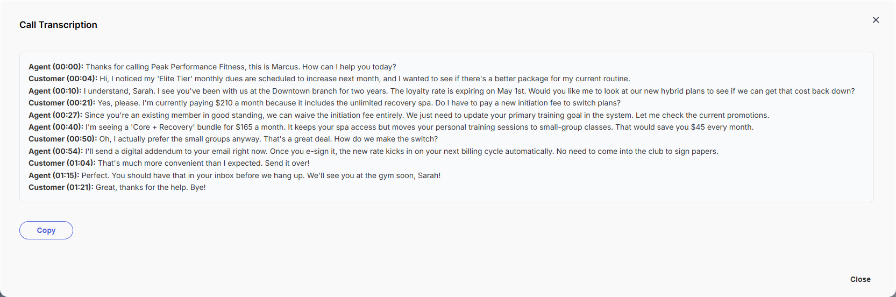
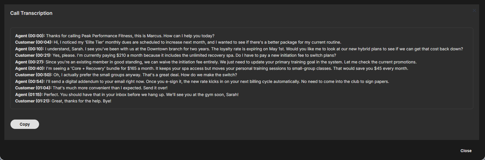

# Example: Call Transcription Viewer

Displays a formatted call transcript inside a `mosaic.form()` popup using a `description` field for the content and an inline `button` field to copy the text to the clipboard.

This pattern is useful any time you need to show structured read-only content - a transcript, a record summary, a rendered template preview - with a simple action attached.

---

## What it demonstrates

- Using a `description` field to render Markdown content in a form
- Using an inline `button` field to trigger a JavaScript action
- Using `mosaic.ui.host.splash.show()` for toast feedback from inside the widget (see note below)
- Sizing the popup with explicit `width`/`height` for content-heavy displays

---

## Code

```javascript
const transcript = `**Agent (00:00):** Thanks for calling Peak Performance Fitness, this is Marcus. How can I help you today?
**Customer (00:04):** Hi, I noticed my 'Elite Tier' monthly dues are scheduled to increase next month, and I wanted to see if there's a better package for my current routine.
**Agent (00:10):** I understand, Sarah. I see you've been with us at the Downtown branch for two years. The loyalty rate is expiring on May 1st. Would you like me to look at our new hybrid plans to see if we can get that cost back down?
**Customer (00:21):** Yes, please. I'm currently paying $210 a month because it includes the unlimited recovery spa. Do I have to pay a new initiation fee to switch plans?
**Agent (00:27):** Since you're an existing member in good standing, we can waive the initiation fee entirely. We just need to update your primary training goal in the system. Let me check the current promotions.
**Agent (00:40):** I'm seeing a 'Core + Recovery' bundle for $165 a month. It keeps your spa access but moves your personal training sessions to small-group classes. That would save you $45 every month.
**Customer (00:50):** Oh, I actually prefer the small groups anyway. That's a great deal. How do we make the switch?
**Agent (00:54):** I'll send a digital addendum to your email right now. Once you e-sign it, the new rate kicks in on your next billing cycle automatically. No need to come into the club to sign papers.
**Customer (01:04):** That's much more convenient than I expected. Send it over!
**Agent (01:15):** Perfect. You should have that in your inbox before we hang up. We'll see you at the gym soon, Sarah!
**Customer (01:21):** Great, thanks for the help. Bye!`;

mosaic.form({
    width:            '75vw',
    height:           '800px',
    title:            'Call Transcription',
    close_on_escape:  true,
    enable_markdown:  true,
    fields: [
        {
            name:  'transcript',
            type:  'description',
            value: transcript
        },
        {
            name:   'copy_btn',
            type:   'button',
            label:  'Copy',
            style:  'secondary',
            action: "navigator.clipboard.writeText(document.querySelector('.field-description').innerText)" +
                    ".then(() => mosaic.ui.host.splash.show('Copied to clipboard!', 'success'))"
        }
    ],
    buttons: ['Close']
});
```

---

## Screenshots





---

## Notes

**`mosaic.ui.host.splash.show()` vs `mosaic.splash()`**

The `action` expression on an inline `button` field runs inside the widget iframe. The client script helper's `mosaic.splash()` is not accessible from there. Use `mosaic.ui.host.splash.show(message, type)` instead - it calls the widget's internal toast directly.

| Context | Method to use |
|---|---|
| Client script (outside widget) | `mosaic.splash.success('...')` |
| Widget button `action` expression | `mosaic.ui.host.splash.show('...', 'success')` |

**Targeting the description content**

`document.querySelector('.field-description').innerText` works when there is one description field in the form. If you have multiple description fields, give each a unique selector or use `document.getElementById('field_transcript')` (Mosaic sets the element ID from the field `name`).