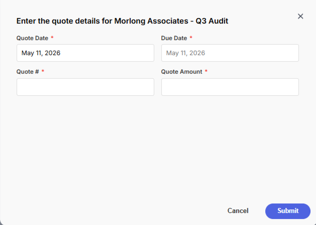
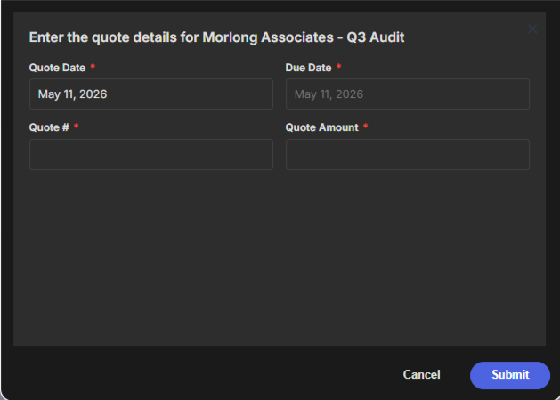
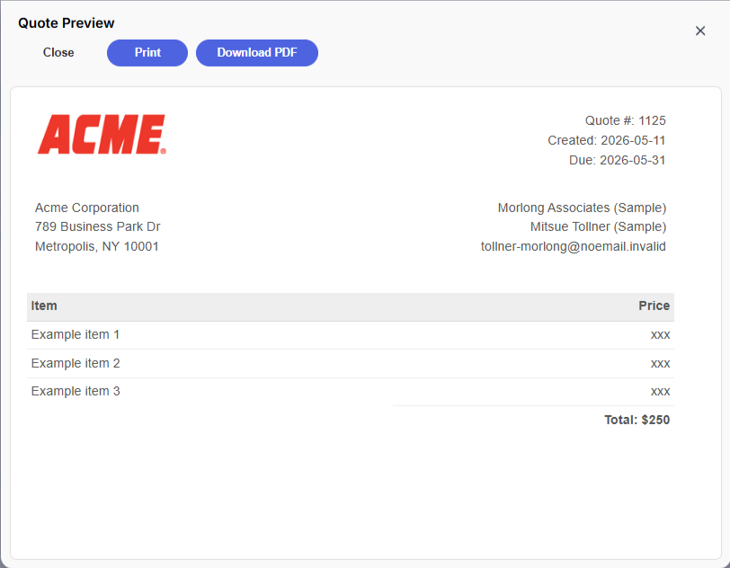
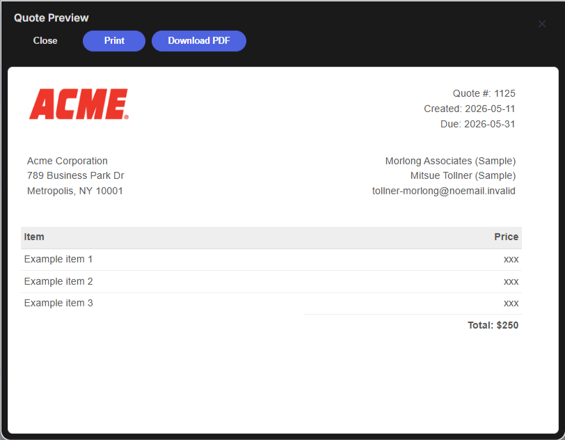
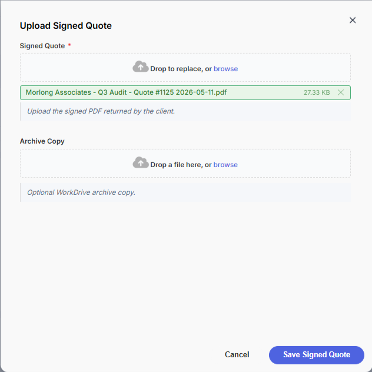
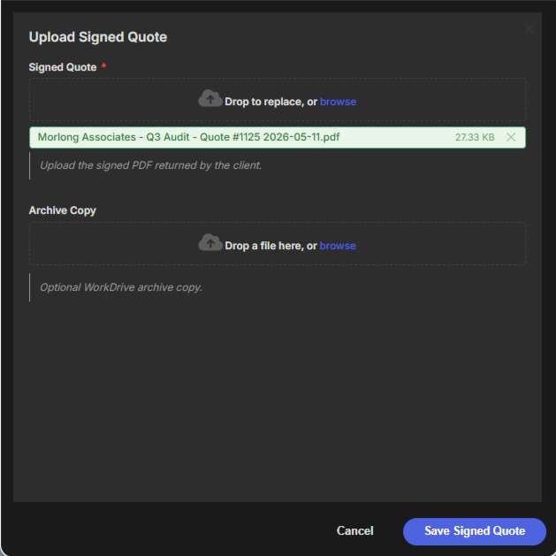

# Example: Quote Preview and Signed Upload

Preview an HTML quote, optionally download it as a PDF, then upload the signed copy back to CRM and WorkDrive.

---

## Code

```javascript
const deal = $Page.record;
const account = deal.Account_Name_Lookup_Id
    ? ZDK.Apps.CRM.Accounts.fetchById(deal.Account_Name_Lookup_Id)
    : {};

const contact = deal.Contact_Name_Lookup_Id
    ? ZDK.Apps.CRM.Contacts.fetchById(deal.Contact_Name_Lookup_Id)
    : {};

const quoteResponse = mosaic.form({
    title: `Enter the quote details for ${deal.Deal_Name}`,
    height: '500px',
    width: '700px',
    fields: [
        {
            name: 'quote_date',
            label: 'Quote Date',
            type: 'date',
            required: true,
            default_value: 'today',
            width: '50%'
        },
        {
            name: 'due_date',
            label: 'Due Date',
            type: 'date',
            required: true,
            width: '50%'
        },
        {
            name: 'quote_number',
            label: 'Quote #',
            type: 'number',
            required: true,
            pattern: '^\\d{4}$',
            pattern_message: 'Must be 4 digits (eg. 1234)',
            width: '50%'
        },
        {
            name: 'amount',
            label: 'Quote Amount',
            type: 'text',
            required: true,
            pattern: '^\\$?\\d{1,3}(?:,?\\d{3})*(?:\\.\\d{2})?$',
            pattern_message: 'Please enter a valid amount',
            width: '50%'
        }
    ]
});

if (!mosaic.utils.isSuccess(quoteResponse)) return;

const quote = mosaic.utils.getData(quoteResponse);
const quoteHtml = getQuoteHtml(quote, account, contact);
const quoteFilename = sanitizeFilename(`${deal.Deal_Name} - Quote #${quote.quote_number} ${quote.quote_date}`);

const previewResponse = mosaic.html(quoteHtml, {
    title: 'Quote Preview',
    filename: quoteFilename,
    width: '900px',
    height: '80vh',
    writer_connection: 'writer_connection',
    content_theme: 'content',
    buttons: [
        'Close',
        { label: 'Print', value: 'print' },
        { label: 'Download PDF', style: 'primary', value: 'download' }
    ]
});

if (mosaic.utils.isCancelled(previewResponse)) return;

const uploadResponse = mosaic.form({
    title: 'Upload Signed Quote',
    module: 'Deals',
    record_id: deal.id,
    height: '700px',
    width: '700px',
    fields: [
        {
            name: 'signed_quote',
            label: 'Signed Quote',
            type: 'file',
            accept: '.pdf',
            required: true,
            filename: `${quoteFilename} (SIGNED)`,
            destination: {
                type: 'field',
                field_name: 'Signed_Quote',
                field_type: 'file'
            },
            instructions: 'Upload the signed PDF returned by the client.'
        },
        {
            name: 'workdrive_copy',
            label: 'Archive Copy',
            type: 'file',
            accept: '.pdf',
            filename: `${quoteFilename} (SIGNED)`,
            destination: {
                type: 'workdrive',
                folder_id: deal.Workdrive_Folder_ID,
                connection: 'workdrive_connection',
                override_existing: true
            },
            instructions: 'Optional WorkDrive archive copy.'
        }
    ],
    buttons: [
        'Cancel',
        { label: 'Save Signed Quote', style: 'primary' }
    ]
});

if (!mosaic.utils.isSuccess(uploadResponse)) return;

const uploadData = mosaic.utils.getData(uploadResponse);

mosaic.message.success('Signed quote uploaded.', {
    title: 'Quote Complete'
});

console.log('CRM file field result:', uploadData.signed_quote);
console.log('WorkDrive archive result:', uploadData.workdrive_copy);

// ╭──────────────────────────────────────────────────╮
// │             example helper functions             │
// ╰──────────────────────────────────────────────────╯ 

function escapeHtml(value) { return String(value ?? '').replace(/[&<>"']/g, char => ({ '&': '&amp;', '<': '&lt;', '>': '&gt;', '"': '&quot;', "'": '&#039;' }[char])); }

function formatCurrency(value) { const amount = String(value ?? '').trim(); return amount.startsWith('$') ? amount : `$${amount}`; }

function sanitizeFilename(value) { return String(value ?? '').replace(/[<>:"/\\|?*]+/g, '').replace(/\s+/g, ' ').trim(); }

// ── demo-only helper used to generate example quote html ──────────────

function getQuoteHtml(quote, account, contact) {
    const h             = escapeHtml;
    const quote_number  = h(quote.quote_number);
    const quote_date    = h(quote.quote_date);
    const due_date      = h(quote.due_date);
    const amount        = h(formatCurrency(quote.amount));
    const account_name  = h(account.Account_Name || 'Account Name');
    const contact_name  = h(contact.Full_Name || 'Contact Name');
    const contact_email = h(contact.Email || 'contact@example.com');

    return `
        <!DOCTYPE html>
        <html>
        <head>
            <meta charset="utf-8">
            <title>Quote #${quote_number}</title>
            <style>
                .quote-box{max-width:800px;font-size:16px;line-height:24px;font-family:'Helvetica Neue',Helvetica,Arial,sans-serif;color:#555}
                .quote-box table{width:100%;line-height:inherit;text-align:left;border-collapse:collapse}
                .quote-box table td{padding:5px;vertical-align:top}
                .quote-box table tr td:nth-child(2){text-align:right}
                .quote-box table tr.top table td{padding-bottom:20px}
                .quote-box table tr.top table td.title{font-size:45px;line-height:45px;color:#333}
                .quote-box table tr.information table td{padding-bottom:40px}
                .quote-box table tr.heading td{background:#eee;border-bottom:1px solid #ddd;font-weight:700}
                .quote-box table tr.item td{border-bottom:1px solid #eee}
                .quote-box table tr.item.last td{border-bottom:none}
                .quote-box table tr.total td:nth-child(2){border-top:2px solid #eee;font-weight:700}
                @media only screen and (max-width:600px){.quote-box table tr.top table td,.quote-box table tr.information table td{width:100%;display:block;text-align:center}}
            </style>
        </head>
        <body>
            <div class="quote-box">
                <table cellpadding="0" cellspacing="0">
                    <tr class="top">
                        <td colspan="2">
                            <table>
                                <tr>
                                    <td class="title">
                                        
                                    </td>
                                    <td>
                                        Quote #: ${quote_number}<br>
                                        Created: ${quote_date}<br>
                                        Due: ${due_date}
                                    </td>
                                </tr>
                            </table>
                        </td>
                    </tr>

                    <tr class="information">
                        <td colspan="2">
                            <table>
                                <tr>
                                    <td>
                                        Acme Corporation<br>
                                        789 Business Park Dr<br>
                                        Metropolis, NY 10001
                                    </td>
                                    <td>
                                        ${account_name}<br>
                                        ${contact_name}<br>
                                        ${contact_email}
                                    </td>
                                </tr>
                            </table>
                        </td>
                    </tr>

                    <tr class="heading">
                        <td>Item</td>
                        <td>Price</td>
                    </tr>

                    <tr class="item">
                        <td>Example item 1</td>
                        <td>xxx</td>
                    </tr>

                    <tr class="item">
                        <td>Example item 2</td>
                        <td>xxx</td>
                    </tr>

                    <tr class="item last">
                        <td>Example item 3</td>
                        <td>xxx</td>
                    </tr>

                    <tr class="total">
                        <td></td>
                        <td>Total: ${amount}</td>
                    </tr>
                </table>
            </div>
        </body>
        </html>
    `;
}
```

--- 

## Screenshots

<details>
<summary>Invoice details form</summary>
    
    
</details>

<details>
<summary>Invoice html preview</summary>
    
    
</details>

<details>
<summary>Invoice upload form</summary>
    
    
</details>

---

## Notes

- `mosaic.html()` previews the HTML and can route a button to PDF download with `value: 'download'`.
- The CRM field upload stores the signed PDF on the Deal record.
- The WorkDrive upload archives a second copy when a folder ID is available.
- If the WorkDrive upload should be required too, add `required: true` to that field.
