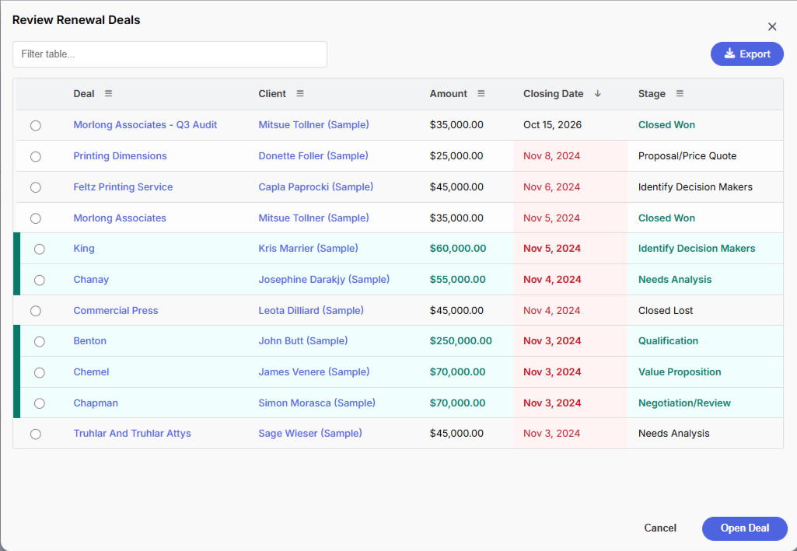
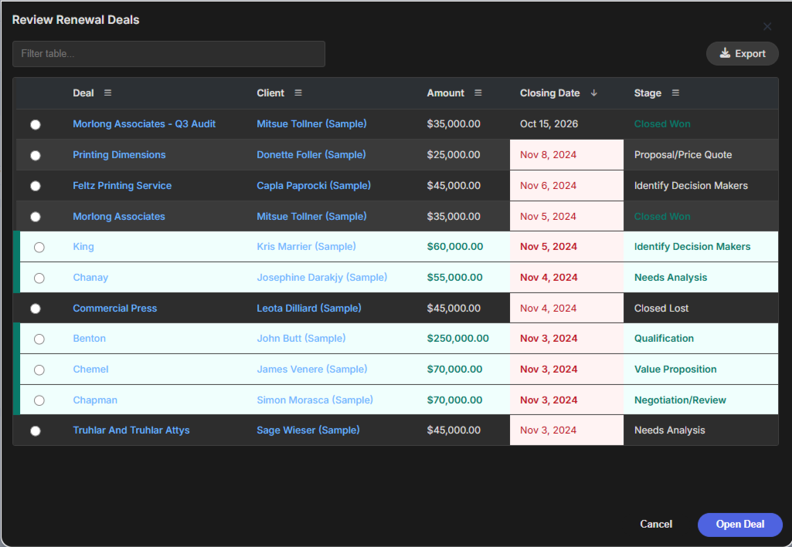

# Example: Populate table using COQL query + conditional formatting rules

This example shows a selectable Deals table with formatted currency/date columns and conditional cell/row styling. Formatting only changes what the user sees; selected row data still returns the original CRM values.

---

## Code

```javascript
const result = mosaic.table({
    title: 'Review Renewal Deals',
    width: '40vw',
    height: '55vh',
    source: { type: 'coql', query: "select id, Deal_Name, Contact_Name.Full_Name, Contact_Name, Amount, Closing_Date, Stage from Deals where Stage != null limit 200" },
    show_search: true,
    allow_export: true,
    allow_multiple: false,
    per_page: 50,
    required: true,
    sort_field: 'Closing_Date',
    sort_order: 'desc',
    buttons: ['Cancel', { label: 'Open Deal', style: 'primary' }],
    columns: [{
            header: 'Deal',
            key: 'Deal_Name',
            link: {
                module: 'Deals',
                id_key: 'id'
            }
        },
        {
            header: 'Client',
            key: 'Contact_Name.Full_Name',
            link: {
                module: 'Contacts',
                id_key: 'Contact_Name.id'
            }
        },
        {
            header: 'Amount',
            key: 'Amount',
            format: {
                type: 'currency',
                currency: 'USD',
                decimals: 2
            },
            rules: [{
                    operator: 'greater_than',
                    value: 50000,
                    target: 'row',
                    style: {
                        'background-color': '#f0fffd',
                        color: '#097969',
                        'border-left': '10px solid #097969',
                        'font-weight': '600'
                    }
                },
                {
                    operator: 'less_than',
                    value: 0,
                    style: {
                        color: '#c1121f',
                        'font-weight': '600'
                    }
                }
            ]
        },
        {
            header: 'Closing Date',
            key: 'Closing_Date',
            format: {
                type: 'date',
                input_date_format: 'yyyy-MM-dd'
            },
            rules: [{
                operator: 'before',
                value: '2026-06-01',
                target: 'cell',
                style: {
                    'background-color': '#fff3f3',
                    color: '#c1121f'
                }
            }]
        },
        {
            header: 'Stage',
            key: 'Stage',
            rules: [{
                    operator: 'equals',
                    value: 'Closed Won',
                    style: {
                        color: '#097969',
                        'font-weight': '600'
                    }
                },
                {
                    operator: 'equals',
                    value: 'At Risk',
                    style: {
                        color: '#c1121f',
                        'font-weight': '600'
                    }
                }
            ]
        }
    ]
});

if (mosaic.utils.isSuccess(result)) {
    const deal = mosaic.utils.getData(result);

    ZDK.Client.navigateTo('record_detail', {
        module: 'Deals',
        record_id: deal.id
    });

}
```
---

## Screenshots




---

## Notes

  - `format.decimals` controls both minimum and maximum decimal places.
  - Date columns use the current CRM user's date format for display.
  - `format.input_date_format` only helps Mosaic parse non-ISO input values.
  - `rules` compare against raw row values, not formatted display text.
  - `target: 'row'` styles the entire row when the rule matches.
