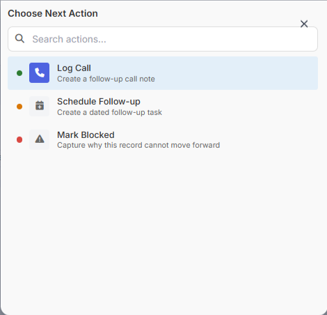
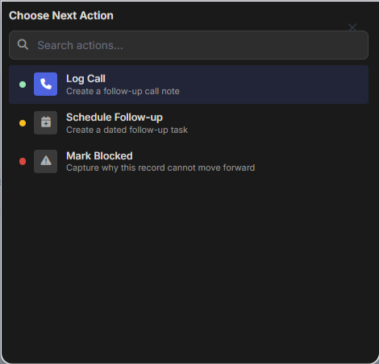
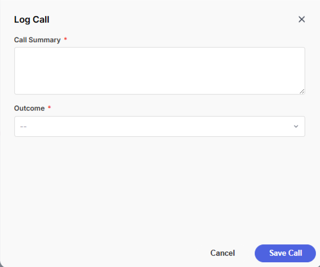
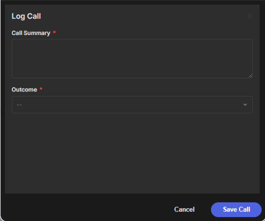
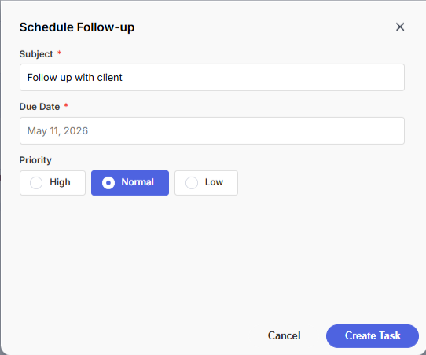
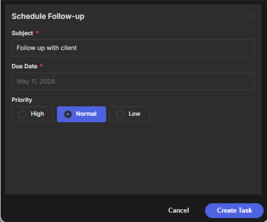
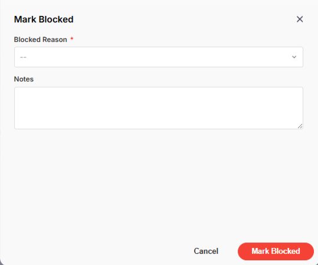
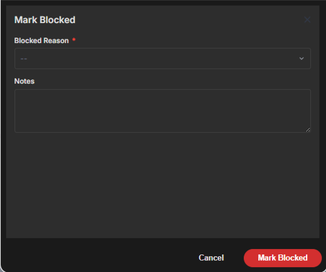

# Example: Task Triage Launcher

Use `mosaic.launcher()` as a quick-action menu with status colors, then show a follow-up form or message based on the selected action.


```javascript
const action = mosaic.launcher([{
        actual_value: 'log_call',
        display_value: 'Log Call',
        description: 'Create a follow-up call note',
        icon: 'fa-phone',
        status_color: 'success'
    },
    {
        actual_value: 'schedule_followup',
        display_value: 'Schedule Follow-up',
        description: 'Create a dated follow-up task',
        icon: 'fa-calendar-plus',
        status_color: 'warning'
    },
    {
        actual_value: 'mark_blocked',
        display_value: 'Mark Blocked',
        description: 'Capture why this record cannot move forward',
        icon: 'fa-triangle-exclamation',
        status_color: '#D94841'
    }
], {
    title: 'Choose Next Action',
    placeholder: 'Search actions...',
    show_description: true,
    show_icons: true,
    width: '520px'
});

if (!mosaic.utils.isSuccess(action)) return;

const selected = mosaic.utils.getData(action);

if (selected.actual_value === 'log_call') {
    const result = mosaic.form({
        title: 'Log Call',
        height: '500px',
        fields: [{
                name: 'summary',
                label: 'Call Summary',
                type: 'textarea',
                rows: 4,
                required: true
            },
            {
                name: 'outcome',
                label: 'Outcome',
                type: 'picklist',
                required: true,
                options: ['Connected', 'Left Voicemail', 'No Answer']
            }
        ],
        buttons: ['Cancel', {
            label: 'Save Call',
            style: 'primary'
        }]
    });

    if (mosaic.utils.isSuccess(result)) {
        const data = mosaic.utils.getData(result);
        console.log('Create call note:', data);
        mosaic.message.success('Call note captured.');
    }
}

if (selected.actual_value === 'schedule_followup') {
    const result = mosaic.form({
        title: 'Schedule Follow-up',
        height: '500px',
        fields: [{
                name: 'subject',
                label: 'Subject',
                type: 'text',
                default_value: 'Follow up with client',
                required: true
            },
            {
                name: 'due_date',
                label: 'Due Date',
                type: 'date',
                required: true,
                disable_past_dates: true
            },
            {
                name: 'priority',
                label: 'Priority',
                type: 'radio',
                default_value: 'Normal',
                options: ['High', 'Normal', 'Low']
            }
        ],
        buttons: ['Cancel', {
            label: 'Create Task',
            style: 'primary'
        }]
    });

    if (mosaic.utils.isSuccess(result)) {
        const data = mosaic.utils.getData(result);
        console.log('Create task:', data);
        mosaic.message.success('Follow-up task ready.');
    }
}

if (selected.actual_value === 'mark_blocked') {
    const result = mosaic.form({
        title: 'Mark Blocked',
        height: '500px',
        fields: [{
                name: 'reason',
                label: 'Blocked Reason',
                type: 'picklist',
                required: true,
                options: ['Missing Information', 'Waiting on Client', 'Internal Review']
            },
            {
                name: 'notes',
                label: 'Notes',
                type: 'textarea',
                rows: 3
            }
        ],
        buttons: [
            'Cancel',
            {
                label: 'Mark Blocked',
                style: 'destructive',
                value: 'blocked'
            }
        ]
    });

    if (mosaic.utils.wasButtonValue(result, 'blocked')) {
        console.log('Blocked details:', mosaic.utils.getData(result));
        mosaic.message.warning('Record marked as blocked.');
    }
}
```

---

## Screenshots

<details>
<summary>Launcher screenshots</summary>
    
    
</details>

<details>
<summary>Log Call screenshots</summary>
    
    
</details>

<details>
<summary>Follow Up screenshots</summary>
    
    
</details>

<details>
<summary>Mark Blocked screenshots</summary>
    
    
</details>

---

## Notes

- `status_color` can be a semantic color such as `success` / `warning`, or a hex color.
- The selected launcher item is returned in `response.data`.
- Use `actual_value` for branching logic and `display_value` for user-facing text.
- Follow-up dialogs can use `mosaic.form()` for data capture or `mosaic.message()` for confirmation.