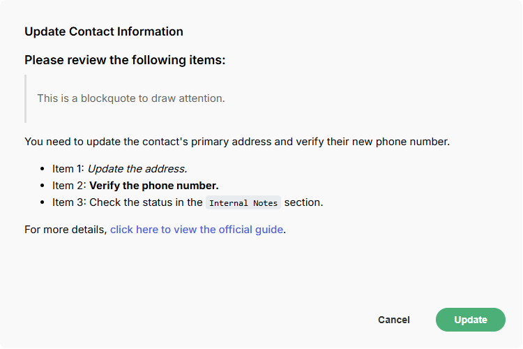
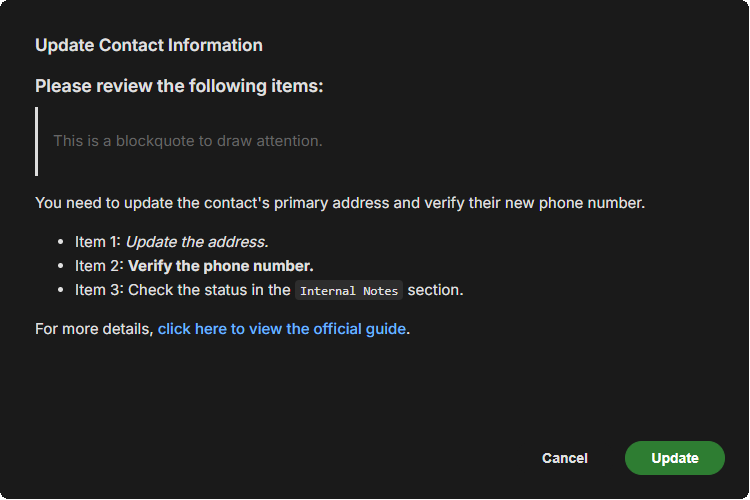

# mosaic.confirmation()

Displays a confirmation dialog with a message and configurable buttons. Use this for destructive action gates, warnings, or any prompt that requires an explicit user decision before proceeding. For read-only informational popups where no decision is required, use `mosaic.message()` instead.

```javascript
mosaic.confirmation(message, options)
```

---




---

## Parameters

| Parameter | Type | Default | Required | Description |
|---|---|---|---|---|
| `message` | string | | ✅ | Body text of the confirmation (supports Markdown by default) |
| `options.title` | string | `''` | | Title displayed above the message |
| `options.buttons` | array | `['Cancel', 'OK']` | |  Button labels or `{ label, style, value }` objects - see [Buttons](../reference/buttons.md) |
| `options.enable_markdown` | boolean | `true` | |  Enable Markdown rendering in the message |
| `options.submit_on_enter` | boolean | `false` | |  Trigger the primary button when Enter is pressed |

See [Shared Popup / Flyout Options](../reference/popup-flyout-options.md) for positioning and animation options.

---

## Returns

`MosaicResponse` | `null`

`response.data` is an empty array `[]`. Use `mosaic.utils.isSuccess()` or `mosaic.utils.wasButtonClicked()` to determine the outcome.

---

## Examples

#### Example: Basic confirmation

```javascript
const result = mosaic.confirmation('Are you sure you want to proceed?');

if (mosaic.utils.isSuccess(result)) {
    // user clicked OK
}
```

#### Example: With a title and destructive button

```javascript
const result = mosaic.confirmation('This will permanently delete the record and all related activity history.', {
    title: 'Delete Record',
    buttons: ['Cancel', { label: 'Delete', style: 'destructive' }],
    width: '500px'
});

if (mosaic.utils.wasButtonClicked(result, 'Delete')) {
    // proceed with deletion
}
```

#### Example: Three-option dialog

```javascript
const result = mosaic.confirmation('How would you like to save your changes?', {
    title: 'Save Changes',
    buttons: [
        'Cancel',
        { label: 'Save Draft',  style: 'secondary' },
        { label: 'Publish Now', style: 'primary' }
    ]
});

if (mosaic.utils.wasButtonClicked(result, 'Publish Now')) {
    // publish path
} else if (mosaic.utils.wasButtonClicked(result, 'Save Draft')) {
    // draft path
}
```

#### Example: Markdown message body

```javascript
const result = mosaic.confirmation(
    '### Please review the following items:\n' +
    '> This is a blockquote to draw attention.\n\n' +
    'You need to update the contact\'s primary address and verify their new phone number.\n\n' +
    '- Item 1: *Update the address.*\n' +
    '- Item 2: __Verify the phone number.__\n' +
    '- Item 3: Check the status in the `Internal Notes` section.\n\n' +
    'For more details, [click here to view the official guide](https://www.example.com).', {
        title: 'Update Contact Information',
        buttons: ['Cancel', { label: 'Update', style: 'success' }],
        width: '750px',
        height: '450px',
        top: '0'
    }
);
```