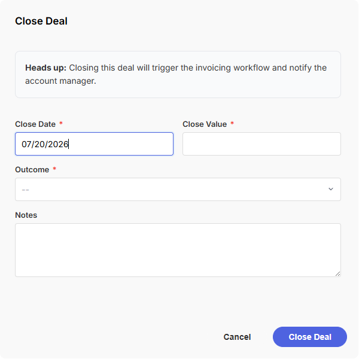
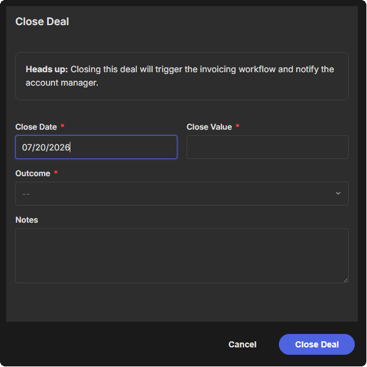

# mosaic.form()

Displays a multi-field form popup. Supports all field types, inline validation, file uploads, multi-column layouts, conditional field visibility, and field grouping. Returns all field values as an object keyed by field name.

```javascript
mosaic.form(options)
```

---




---

## Parameters

| Parameter | Type | Default | Required | Description |
|---|---|---|---|---|
| `options.title` | string | `''` | | Form title displayed above the fields |
| `options.fields` | array | `[]` | ✅ | Array of field configuration objects - see [Field Types](../reference/fields.md) |
| `options.default_values` | object | `{}` | | Pre-populate fields by name: `{ field_name: value, ... }`. Overrides any per-field `default_value`. Useful for re-showing a form with previously captured data |
| `options.buttons` | array | `['Cancel', 'Submit']` | | Button labels or `{ label, style, value, validate }` objects - see [Buttons](../reference/buttons.md) |
| `options.enable_markdown` | boolean | `true` | | Enable Markdown in `description` field types |
| `options.submit_on_enter` | boolean | `true` | | Trigger primary button on Enter (disabled inside textarea and button fields) |
| `options.force_focus` | boolean | `true` | | Auto-focus the first input field on load |
| `options.module` | string | - | for `file` fields (`attachments`) | CRM module API name. |
| `options.record_id` | string | - | for `file` fields (`attachments`) | CRM record ID. |

See [Shared Popup / Flyout Options](../reference/popup-flyout-options.md) for positioning and animation options.

---

## Returns

`MosaicResponse` | `null`

`response.data` is an object with one key per field `name`. Fields hidden by [conditions](../reference/fields.md#conditions) are excluded from the response. [Group](#groups) fields do not appear in the response - their child fields are returned individually. See [Response](../reference/response.md) for full details.

```javascript
const result = mosaic.form({
    fields: [
        { name: 'first_name', label: 'First Name', type: 'text' },
        { name: 'email',      label: 'Email',       type: 'email' },
        { name: 'stage',      label: 'Stage',       type: 'picklist', options: ['Open', 'Won'] }
    ]
});

if (mosaic.utils.isSuccess(result)) {
    const data = mosaic.utils.getData(result);
    // data.first_name          → string
    // data.email               → string
    // data.stage.actual_value  → string (picklist)
}
```

---

## Layout

Use the `width` property to create multi-column layouts. Fields on the same row should add up to `100%`. Use `break_before` to force a field onto a new line.

```javascript
fields: [
    { name: 'first_name', label: 'First Name', type: 'text', width: '50%' },
    { name: 'last_name',  label: 'Last Name',  type: 'text', width: '50%' },
    { name: 'email',      label: 'Email',      type: 'email' }  // full width
]
```

See [Layout](../reference/fields.md#layout) in the field types reference for details on `width` and `break_before`.

---

## Groups

Use the `group` field type to wrap related fields in a container. Groups support `conditions` at the group level, so you can show or hide an entire section with one condition instead of repeating it on each child field.

```javascript
{
    name: 'address_section',
    type: 'group',
    label: 'Home Address',
    style: 'outlined',
    conditions: [{ field: 'has_address', operator: 'equals', value: 'Yes' }],
    fields: [
        { name: 'street', label: 'Street', type: 'text' },
        { name: 'city',   label: 'City',   type: 'text', width: '50%' },
        { name: 'state',  label: 'State',  type: 'text', width: '25%' },
        { name: 'zip',    label: 'Zip',    type: 'text', width: '25%' }
    ]
}
```

When a group is hidden, all child fields are excluded from both validation and `response.data`. Group fields themselves do not appear in the response - child fields are returned individually by their own `name`.

Use `{ type: 'divider' }` to add visual separation between sections. Dividers support an optional `label` and can also be conditionally shown/hidden.

See [group](../reference/fields.md#field-group ) and [divider](../reference/fields.md#field-divider) in the field types reference for all properties.

---

## Conditional Fields

Fields can be shown or hidden based on the value of other fields using the `conditions` property. Conditions are evaluated live as the user interacts with the form. When a field's conditions are not met, it is hidden from the layout and excluded from both validation and `response.data`.

Add a `conditions` array to any field. Each condition references another field by `name` and specifies an operator and expected value. All conditions in the array must pass (AND logic) for the field to be visible.

```javascript
{ name: 'start_date', label: 'Start Date', type: 'date',
    conditions: [{ field: 'has_start_date', operator: 'equals', value: 'Yes' }]
}
```

### Condition object

| Property | Type | Required | Description |
|---|---|---|---|
| `field` | string | ✅ | Source field name to evaluate |
| `operator` | string | ✅ | Comparison operator - see table below |
| `value` | any | | Expected value. Not used for `empty` / `not_empty` |

### Operators

| Operator | Applies to | Description |
|---|---|---|
| `not_empty` | all | Field has any value |
| `empty` | all | Field is blank or unselected |
| `equals` | all | Exact scalar match. For checkbox groups and multiselects, passes when any selected value matches |
| `not_equals` | all | Does not match. For checkbox groups and multiselects, passes when no selected value matches |
| `contains` | string, checkbox group, multiselect | String includes substring. For checkbox groups and multiselects, passes when any selected value contains the substring |
| `greater_than` | number | Numeric `>` comparison |
| `less_than` | number | Numeric `<` comparison |
| `between` | number, date | Inclusive range - `value` is `[min, max]` |
| `before` | date | Date is before the given date |
| `after` | date | Date is after the given date |
| `in` | string, picklist, radio, checkbox group, multiselect | Value is one of a set - `value` must be an array. For checkbox groups and multiselects, passes when any selected value is in the set |
| `not_in` | string, picklist, radio, checkbox group, multiselect | Value is not in a set - `value` must be an array. For checkbox groups and multiselects, passes when no selected value is in the set |

> [!NOTE]
> For picklist, radio, checkbox group, and multiselect fields, conditions compare against the `actual_value` - the value submitted in `response.data` - not the display label.

> [!NOTE]
> For checkbox groups and multiselect fields, condition checks are evaluated against the selected values array. Operators such as `equals`, `contains`, and `in` pass when **any selected value** satisfies the condition. Their inverse operators, such as `not_equals` and `not_in`, pass only when **no selected value** satisfies the condition.

### Operator examples

```javascript
// Show when a number exceeds a threshold
{ name: 'justification', label: 'Justification', type: 'textarea',
    conditions: [{ field: 'amount', operator: 'greater_than', value: 10000 }]
}

// Show when a date falls within a range
{ name: 'renewal_note', label: 'Renewal Note', type: 'text',
    conditions: [{ field: 'expiry_date', operator: 'between', value: ['2025-01-01', '2026-12-31'] }]
}

// Show when a date is in the future
{ name: 'reminder', label: 'Set Reminder', type: 'checkbox',
    conditions: [{ field: 'follow_up_date', operator: 'after', value: '2026-01-01' }]
}

// Show when a picklist is one of several values
{ name: 'close_reason', label: 'Close Reason', type: 'textarea',
    conditions: [{ field: 'stage', operator: 'in', value: ['Closed Won', 'Closed Lost'] }]
}

// Multiple conditions (AND) - both must be true
{ name: 'escalation_note', label: 'Escalation Note', type: 'textarea',
    conditions: [
        { field: 'priority', operator: 'equals', value: 'High' },
        { field: 'amount', operator: 'greater_than', value: 50000 }
    ]
}
```

### Full conditional example

This example uses groups, dividers, and conditions together. Each "Yes" radio reveals an outlined group with related detail fields. Dividers separate the top-level questions visually.

```javascript
const result = mosaic.form({
    title: 'Other Coverage',
    height: '70vh', width: '800px',
    fields: [
        { name: 'partb_in_last_6_months', label: 'Enrolled in Medicare Part B in last 6 months?',
            type: 'radio', required: true, options: ['Yes', 'No'] },
        { name: 'partb_eff_date', label: 'Part B Effective Date', type: 'date', required: true, width: '35%',
            conditions: [{ field: 'partb_in_last_6_months', operator: 'equals', value: 'Yes' }]
        },
        { type: 'divider' },
        { name: 'covered_under_ma', label: 'Coverage from MA/MAPD in past 63 days?',
            type: 'radio', required: true, options: ['Yes', 'No'] },
        { name: 'ma_details', type: 'group', label: 'MA/MAPD Details', style: 'outlined',
            conditions: [{ field: 'covered_under_ma', operator: 'equals', value: 'Yes' }],
            fields: [
                { name: 'ma_eff_date',  label: 'Effective Date', type: 'date', required: true, width: '50%' },
                { name: 'ma_term_date', label: 'Term Date',      type: 'date', required: true, width: '50%' },
                { name: 'ma_intend_to_replace', label: 'Intend to replace MA?',
                    type: 'radio', required: true, options: ['Yes', 'No'] }
            ]
        },
        { type: 'divider' },
        { name: 'covered_under_ms', label: 'Medigap policy currently in force?',
            type: 'radio', required: true, options: ['Yes', 'No'] },
        { name: 'ms_details', type: 'group', label: 'Medigap Details', style: 'outlined',
            conditions: [{ field: 'covered_under_ms', operator: 'equals', value: 'Yes' }],
            fields: [
                { name: 'ms_company', label: 'Company', type: 'text', required: true, width: '50%' },
                { name: 'ms_plan',    label: 'Plan',    type: 'text', required: true, width: '50%' },
                { name: 'ms_intend_to_replace', label: 'Intend to replace?',
                    type: 'radio', required: true, options: ['Yes', 'No'] },
                { name: 'ms_eff_date',  label: 'Effective Date', type: 'date', required: true, width: '50%' },
                { name: 'ms_term_date', label: 'Term Date',      type: 'date', required: true, width: '50%' }
            ]
        }
    ]
});

if (mosaic.utils.isSuccess(result)) {
    const data = mosaic.utils.getData(result);
    // Only visible fields are included in data
    // If covered_under_ma is "No", data will not contain ma_eff_date, ma_term_date, etc.
    // Group names (ma_details, ms_details) do not appear in data - child fields are keyed by their own name
}
```

---

## Examples

#### Example: Contact information form

```javascript
const result = mosaic.form({
    title: 'New Contact',
    height: '650px',
    fields: [
        { name: 'first_name', label: 'First Name', type: 'text',  required: true, width: '50%' },
        { name: 'last_name',  label: 'Last Name',  type: 'text',  required: true, width: '50%' },
        { name: 'email',      label: 'Email',      type: 'email', required: true, width: '50%' },
        { name: 'phone',      label: 'Phone',      type: 'tel',                   width: '50%' },
        { name: 'role',       label: 'Role',       type: 'picklist',              width: '65%', options: ['Decision Maker', 'Influencer', 'End User', 'Champion'] },
        { name: 'notes',      label: 'Notes',      type: 'textarea', rows: 3 }
    ]
});

if (mosaic.utils.isSuccess(result)) {
    const data = mosaic.utils.getData(result);
    // data.first_name
    // data.role.actual_value
}
```

#### Example: Deal close form with description block

```javascript
const result = mosaic.form({
    title: 'Close Deal',
    height: '600px',
    width: '600px',
    enable_markdown: true,
    fields: [
        {
            name: 'notice',
            type: 'description',
            value: '**Heads up:** Closing this deal will trigger the invoicing workflow and notify the account manager.'
        },
        { name: 'close_date',  label: 'Close Date',  type: 'date',     required: true, default_value: 'today', width: '50%' },
        { name: 'close_value', label: 'Close Value',  type: 'number',   required: true, min: 0, width: '50%' },
        { name: 'stage',       label: 'Outcome',      type: 'picklist', required: true,
          options: ['Closed Won', 'Closed Lost'] },
        { name: 'reason',      label: 'Notes',        type: 'textarea' }
    ],
    buttons: ['Cancel', { label: 'Close Deal', style: 'primary' }]
});
```

#### Example: Multi-button form with branching

```javascript
const result = mosaic.form({
    title: 'Review Application',
    height: '300px',
    width: '600px',
    fields: [
        { name: 'score',    label: 'Score (1–10)', type: 'number', min: 1, max: 10, required: true, width: '30%' },
        { name: 'comments', label: 'Comments',     type: 'textarea', rows: 4 }
    ],
    buttons: [
        'Cancel',
        { label: 'Reject',  style: 'destructive' },
        { label: 'Approve', style: 'success' }
    ]
});

if (mosaic.utils.wasButtonClicked(result, 'Approve')) {
    approveApplication(mosaic.utils.getData(result));
} else if (mosaic.utils.wasButtonClicked(result, 'Reject')) {
    rejectApplication(mosaic.utils.getData(result));
}
```