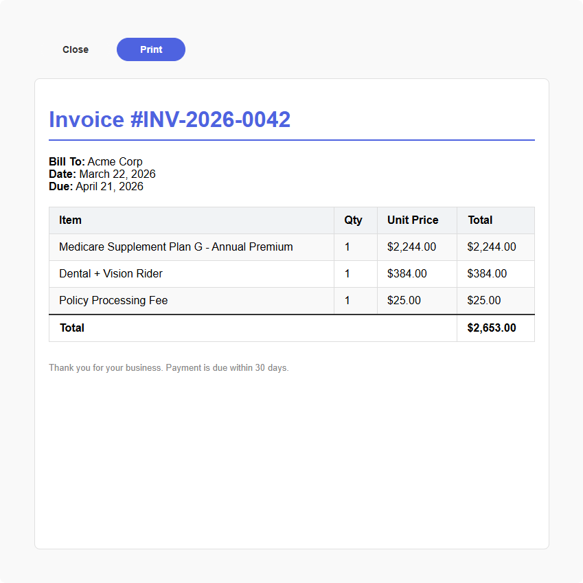
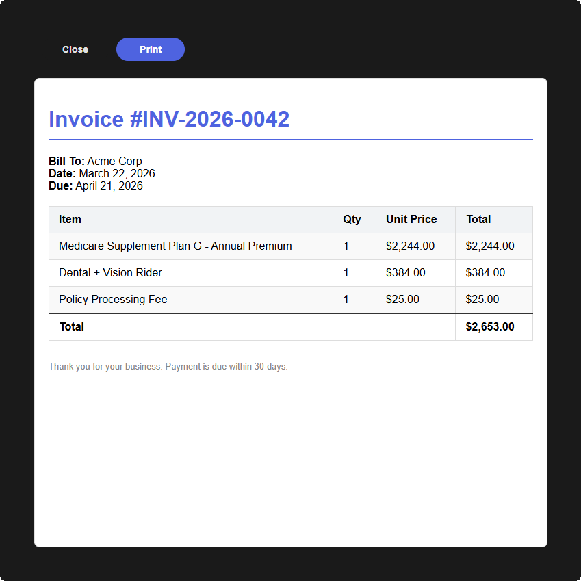

# mosaic.html()

Displays an HTML preview popup with optional print and PDF download support. Use this to show rendered HTML content - invoices, email templates, reports, letters - with configurable buttons for printing via the browser's native print dialog or downloading as PDF (delegated to `mosaic.pdf` via the Zoho Writer API). For PDFs that already exist as files or base64 strings, use `mosaic.pdf()` instead.

```javascript
mosaic.html(content, options)
```

---




---

## Parameters

| Parameter | Type | Default | Required | Description |
|---|---|---|---|---|
| `content` | string | | ✅ | Raw HTML string to display. Accepts plain HTML, URL-encoded, HTML-entity-encoded, or JSON-stringified HTML - all are decoded automatically |
| `options.title` | string | `''` | | Title displayed above the preview |
| `options.filename` | string | | | PDF filename - used as the `<title>` of the print window (which becomes the default save-as name) and as the download filename for PDF conversion. The `.pdf` extension is stripped if present |
| `options.mode` | string | `'preview'` | | Viewer mode - see [Modes](#modes) below |
| `options.buttons` | array | `['Close', 'Print']` | | Button labels or `{ label, style, value }` objects - see [Buttons](../reference/buttons.md) |
| `options.content_theme` | string | `'content'` | | `'content'` lets the HTML's own styles control the preview (matches Print/PDF output); `'widget'` inherits Mosaic light/dark theme colors |
| `options.writer_connection` | string | | | Zoho Writer connection name for PDF conversion. Falls back to `DEFAULTS.connections.writer` if not set. Required when using a "Download PDF" button |

See [Shared Popup / Flyout Options](../reference/popup-flyout-options.md) for positioning and animation options.

---

## Returns

`MosaicResponse` | `null`

The `response.data` object tracks user interactions during the preview session:

| Property | Type | Description |
|---|---|---|
| `base64` | string \| null | Base64-encoded PDF string. Populated only if the user clicked a Download PDF button during preview (the PDF is generated via Writer API). `null` if no download occurred |
| `downloaded` | boolean | `true` if the user clicked a Download PDF button |
| `printed` | boolean | `true` if the user clicked a Print button |

For `print` mode, the response returns immediately - it does not wait for the user to finish printing.

---

## Modes

| Mode | Behavior |
|---|---|
| `'preview'` | Renders the HTML preview with configurable buttons. User clicks Print or Download PDF manually. Default mode |
| `'print'` | Shows a loading spinner, opens the browser print dialog, and closes the widget immediately. The print dialog remains open independently |

> [!NOTE]
> To convert HTML to PDF without a preview, use [`mosaic.html2pdf()`](#mosaichtml2pdf) or [`mosaic.pdf()`](pdf.md) with `{ type: 'html', content: '...' }` as the source.

---

## Button behavior

Non-cancel buttons route to different actions based on their label or `value`:

| Button config | Action |
|---|---|
| `value: 'download'` or label contains `download` / `pdf` | Converts to PDF via Writer API and triggers browser download |
| `value: 'print'` or label contains `print` | Opens the browser's native print dialog |
| Any other `value` string | Closes immediately and returns that value as `button_clicked.value` |
| Anything else | Closes the widget |

This means you can mix print and download buttons in the same viewer:

```javascript
buttons: ['Close', 'Print', { label: 'Download PDF', value: 'download', style: 'primary' }]
```

---

## Examples

#### Example: Preview with print

```javascript
const result = mosaic.html(invoiceHtml, {
    title: 'Invoice Preview',
    filename: 'Invoice_' + invoiceNumber + '.pdf',
    width: '80vw',
    height: '90vh'
});

if (mosaic.utils.wasButtonClicked(result, 'Print')) {
    mosaic.splash.success('Print dialog opened.');
}
```

#### Example: Print directly (no preview)

Shows a brief loading state, opens the print dialog, and closes the widget.

```javascript
mosaic.html(letterHtml, {
    filename: 'Welcome_Letter_' + contactName + '.pdf',
    mode: 'print'
});

mosaic.splash.info('Print dialog opened.');
```

#### Example: Preview with Print and Download PDF buttons

The viewer shows a full preview with three buttons. "Print" opens the browser print dialog; "Download PDF" converts via the Writer API and triggers a download.

```javascript
const result = mosaic.html(invoiceHtml, {
    title: 'Invoice Preview',
    filename: 'Invoice_' + invoiceNumber + '.pdf',
    writer_connection: 'writer_connection',
    buttons: ['Close', 'Print', { label: 'Download PDF', value: 'download', style: 'primary' }],
    width: '80vw',
    height: '90vh'
});
```

#### Example: Minimal preview (view only)

```javascript
mosaic.html(emailPreviewHtml, {
    title: 'Email Preview',
    buttons: ['Close'],
    width: '70vw',
    height: '80vh'
});
```

#### Example: Inherit widget theme for plain HTML

By default (`content_theme: 'content'`), the HTML's own styles control the preview — matching what gets printed or downloaded as PDF. Use `content_theme: 'widget'` when the HTML is plain/unstyled and should pick up the widget's light/dark theme colors instead.

```javascript
mosaic.html(plainHtml, {
    title: 'Quick Note',
    content_theme: 'widget',
    buttons: ['Close']
});
```

#### Example: Content encoding

The `content` parameter automatically handles several encoding formats. You don't need to decode before passing:

```javascript
// Plain HTML - works directly
mosaic.html('<h1>Hello</h1><p>World</p>');

// HTML from a CRM field (may be entity-encoded)
mosaic.html(record.Quote_HTML);

// URL-encoded HTML from an API response
mosaic.html(encodedHtml);

// JSON-stringified HTML
mosaic.html(jsonStringifiedHtml);
```

---

# mosaic.html2pdf()

Convenience wrapper around `mosaic.pdf()` with an `html` source type. Opens a small loader popup, converts the HTML to PDF via the Zoho Writer API, triggers a browser download, and closes automatically.

```javascript
mosaic.html2pdf(content, options)
```

---

## Parameters

| Parameter | Type | Default | Required | Description |
|---|---|---|---|---|
| `content` | string | | ✅ | Raw HTML string to convert |
| `options.filename` | string | `'document.pdf'` | | Output PDF filename |
| `options.writer_connection` | string | | | Zoho Writer connection name. Falls back to `DEFAULTS.connections.writer` |

---

## Returns

`MosaicResponse` | `null`

`response.data` contains `{ base64, downloaded, printed }`- see [`mosaic.pdf()` response](pdf.md#returns) for details.

---

## Connection setup

The Writer connection can be provided per-call via `writer_connection`, or set once via `mosaic.DEFAULTS.connections.writer`. See [Connections](../getting-started.md#connections) for details and required scopes.

---

## Examples

#### Example: Basic conversion and download

```javascript
mosaic.html2pdf(invoiceHtml, {
    filename: 'Invoice_2026.pdf',
    writer_connection: 'writer_connection'
});

mosaic.splash.success('PDF downloaded.');
```
