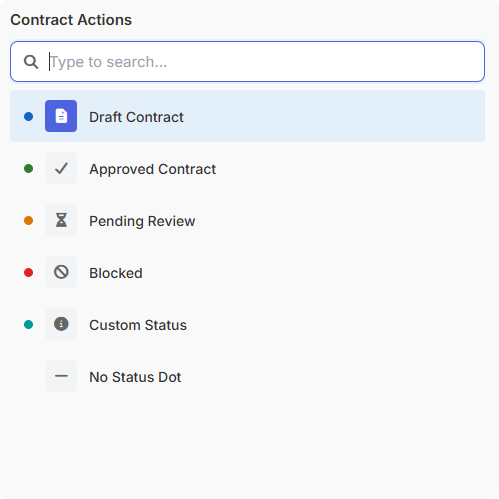
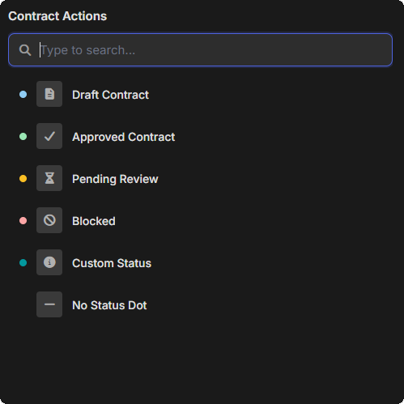

# mosaic.launcher() 

Displays a searchable command palette for quick-action selection. Items are filtered as the user types, navigated with arrow keys, and selected with Enter or click. Returns the selected item.

```javascript
mosaic.launcher(items, options)
```

---

 

---

## Parameters

| Parameter | Type | Default | Required | Description |
|---|---|---|---|---|
| `items` | array | `[]` | ✅ | Array of item objects - see [Items](#items) below |
| `options.title` | string | `''` | | Title displayed above the search input |
| `options.placeholder` | string | `'Type to search...'` | | Search input placeholder text |
| `options.match_mode` | string | `'fuzzy'` | | Search matching mode - see [Match Modes](#match-modes) below |
| `options.show_search` | boolean | `true` | | Show the search input. When `false`, all items are displayed as a static list with keyboard navigation |
| `options.show_description` | boolean | `true` | | Show item descriptions |
| `options.show_icons` | boolean | `true` | | Show item icons. When enabled, items without an explicit `icon` receive an auto-assigned icon based on their label/description |
| `options.show_buttons` | boolean | `false` | | Show footer button row |
| `options.buttons` | array | `[]` | | Button labels or `{ label, style, value }` objects - see [Buttons](../reference/buttons.md) |

See [Shared Popup / Flyout Options](../reference/popup-flyout-options.md) for positioning and animation options.

---

## Returns

`MosaicResponse` | `null`

`response.data` is the selected item object, with an added `index` property indicating its original position in the `items` array. Internal properties (`_highlights`, `_score`) are stripped.

```javascript
{
    actual_value: 'new_deal',
    display_value: 'New Deal',
    description: 'Create a new deal record',
    icon: 'fa-plus',
    index: 0
}
```

---

## Items

Each item represents a selectable action or option.

| Property | Type | Required | Description |
|---|---|---|---|
| `actual_value` | string | | Option actual value - returned in `response.data` |
| `display_value` | string | ✅ | Option display text - also used for search matching |
| `description` | string | | Secondary text shown below the display value |
| `icon` | string | | Font Awesome icon class (e.g. `'fa-plus'`). When omitted and `show_icons` is `true`, an icon is auto-assigned from the display value/description |
| `status_color` | string | | Status dot color shown to the left of the item icon/text. Named types: `'info'`, `'success'`, `'warning'`, `'error'`, `'question'` (matches `mosaic.message` colors). Or a hex code with or without `#` (e.g. `'03989E'` or `'#03989E'`). When any item in the list has a `status_color`, all items reserve a dot column for alignment. Omit for no dot. |

```javascript
[
    { actual_value: 'new_deal',   display_value: 'New Deal',         description: 'Create a new deal record', icon: 'fa-plus' },
    { actual_value: 'send_email', display_value: 'Send Email',       description: 'Email the primary contact', icon: 'fa-envelope' },
    { actual_value: 'run_report', display_value: 'Run Sales Report', icon: 'fa-chart-bar' },
    { actual_value: 'settings',   display_value: 'Settings' }  // icon auto-assigned: fa-gear
]
```

### Auto-assigned icons

When `show_icons` is `true` and an item has no explicit `icon`, the launcher scans the item's `display_value` and `description` for keywords and assigns a relevant icon automatically. Some examples:

| Keywords in label/description | Auto-assigned icon |
|---|---|
| add, new, create | `fa-plus` |
| edit, update, modify | `fa-pen` |
| delete, remove | `fa-trash` |
| email, mail, send | `fa-envelope` |
| call, phone | `fa-phone` |
| report, chart | `fa-chart-bar` |
| setting, config | `fa-gear` |
| user, contact | `fa-user` |
| calendar, schedule | `fa-calendar` |
| save | `fa-floppy-disk` |
| view, preview | `fa-eye` |
| approve, confirm | `fa-check` |
| export | `fa-file-export` |
| filter | `fa-filter` |

If no keywords match, the fallback icon is `fa-circle-dot`. To disable auto-icons entirely, set `show_icons: false`.

---

### Status dots

Use `status_color` when you want to add a small colored indicator to a launcher item without changing the item label or icon.

- Named types use the same semantic palette as `mosaic.message`: `'info'`, `'success'`, `'warning'`, `'error'`, `'question'`
- Custom colors accept 3-digit or 6-digit hex, with or without a leading `#`
- Invalid values are ignored and render as no dot
- If any item in the launcher uses `status_color`, all rows reserve the same dot column so icons and text stay aligned while filtering

```javascript
const result = mosaic.launcher([
    { actual_value: 'draft',    display_value: 'Draft Contract',    status_color: 'info',    icon: 'fa-file-lines' },
    { actual_value: 'approved', display_value: 'Approved Contract', status_color: 'success', icon: 'fa-check' },
    { actual_value: 'pending',  display_value: 'Pending Review',    status_color: 'warning', icon: 'fa-hourglass-half' },
    { actual_value: 'blocked',  display_value: 'Blocked',           status_color: 'error',   icon: 'fa-ban' },
    { actual_value: 'custom',   display_value: 'Custom Status',     status_color: '#03989E', icon: 'fa-circle-info' },
    { actual_value: 'plain',    display_value: 'No Status Dot',                                 icon: 'fa-minus' }
], {
    title: 'Contract Actions'
});
```

---

## Match Modes

| Mode | Behavior |
|---|---|
| `'fuzzy'` | Characters must appear in order but not adjacently. Scored by consecutive matches, word-start bonuses, and gap penalties. Results sorted by score. Default |
| `'contains'` | Display value must include the search term as a substring (case-insensitive) |
| `'exact'` | Display value must start with the search term (case-insensitive) |

All modes highlight matched characters in the item display value.

---

## Keyboard Controls

| Key | Context | Action |
|---|---|---|
| Arrow Down / Up | Search focused | Moves focus to the item list |
| Arrow Down / Up | Items focused | Navigates between items |
| Enter | Any | Selects the highlighted item |
| Home / End | Items focused | Jumps to first / last item |
| Any letter, number, or `/` | Items focused | Refocuses the search input and starts typing |
| Space | Items focused | Refocuses the search input |

---

## Examples

#### Example: Basic usage

```javascript
const result = mosaic.launcher([
    { actual_value: 'new_deal',   display_value: 'New Deal',         description: 'Create a new deal record' },
    { actual_value: 'send_email', display_value: 'Send Email',       description: 'Email the primary contact' },
    { actual_value: 'run_report', display_value: 'Run Sales Report', description: 'Generate the weekly pipeline report' },
    { actual_value: 'log_call',   display_value: 'Log Call',         description: 'Record a call activity' },
    { actual_value: 'settings',   display_value: 'Settings',         description: 'Open CRM settings' }
], {
    title: 'Quick Actions'
});

if (mosaic.utils.isSuccess(result)) {
    const selected = mosaic.utils.getData(result);
    switch (selected.actual_value) {
        case 'new_deal':   createDeal(); break;
        case 'send_email': openEmail(); break;
        case 'run_report': runReport(); break;
        case 'log_call':   logCall(); break;
        case 'settings':   openSettings(); break;
    }
}
```

#### Example: With explicit icons and exact matching

```javascript
const result = mosaic.launcher([
    { actual_value: 'plan_f', display_value: 'Plan F', icon: 'fa-shield-halved' },
    { actual_value: 'plan_g', display_value: 'Plan G', icon: 'fa-shield-halved' },
    { actual_value: 'plan_n', display_value: 'Plan N', icon: 'fa-shield-halved' }
], {
    title: 'Select Plan',
    match_mode: 'exact',
    show_description: false,
    height: '300px',
    width: '350px'
});
```

#### Example: Static list (no search)

```javascript
const result = mosaic.launcher([
    { actual_value: 'approve', display_value: 'Approve',          icon: 'fa-check' },
    { actual_value: 'reject',  display_value: 'Reject',           icon: 'fa-xmark' },
    { actual_value: 'defer',   display_value: 'Defer to Manager', icon: 'fa-clock' }
], {
    title: 'Review Decision',
    show_search: false,
    height: '280px',
    width: '350px'
});
```

#### Example: Using the index for array lookups

The `index` property in the response corresponds to the item's position in the original `items` array, useful when you need to reference back to a parallel data structure:

```javascript
const deals = [/* array of deal objects */];

const items = deals.map(function(deal, i) {
    return { actual_value: deal.id, display_value: deal.Deal_Name, description: deal.Stage };
});

const result = mosaic.launcher(items, { title: 'Select Deal' });

if (mosaic.utils.isSuccess(result)) {
    const selected = mosaic.utils.getData(result);
    const deal = deals[selected.index];  // original deal object
}
```
