# mosaic.message()

Displays an informational popup with a styled icon and message body. Use this for success confirmations, error reports, warnings, or any read-only notification that requires acknowledgement before the user continues. For decision-branching dialogs (approve/reject, yes/no), use `mosaic.confirmation()` instead.

```javascript
mosaic.message(message, options)
```

Shorthand methods set `options.type` automatically:

```javascript
mosaic.message.info(message, options)
mosaic.message.success(message, options)
mosaic.message.warning(message, options)
mosaic.message.error(message, options)
mosaic.message.question(message, options)
```

---

## Parameters

| Parameter | Type | Default | Required | Description |
|---|---|---|---|---|
| `message` | string |  | ✅ | Body text (supports Markdown by default) |
| `options.title` | string | `''` | | Title displayed above the message |
| `options.type` | string | `'info'` | |  Sets the icon and color scheme (`info`, `success`, `warning`, `error`, `question`) |
| `options.show_icon` | boolean | `true` | |  Show the type icon |
| `options.show_buttons` | boolean | `true` | |  Show the button row |
| `options.buttons` | array | `['OK']` | |  Button labels or `{ label, style, value }` objects - see [Buttons](../reference/buttons.md) |
| `options.enable_markdown` | boolean | `true` | |  Enable Markdown rendering in the message |
| `options.submit_on_enter` | boolean | `true` | |  Close on Enter key press |

See [Shared Popup / Flyout Options](../reference/popup-flyout-options.md) for positioning and animation options.

---

## Returns

`MosaicResponse` | `null`

`response.data` is an empty array `[]`. For single-button messages this is usually ignored. For multi-button messages, use `mosaic.utils.wasButtonClicked()` to determine which button was clicked.

---

## Examples

### Example 1: Simple info message

```javascript
mosaic.message('Your export is ready. Check your downloads folder.');
```

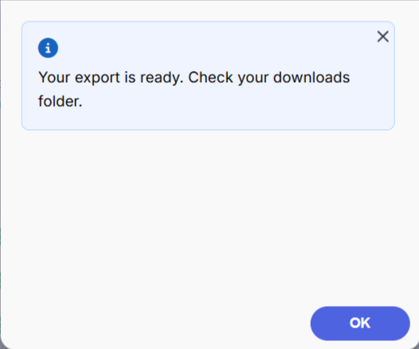 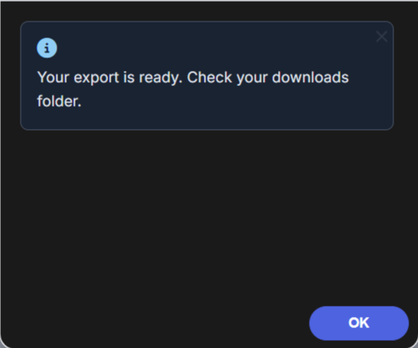

---

### Example 2: Success with title

```javascript
mosaic.message.success('The record was saved and the workflow was triggered.', {
    title: 'Save Complete'
});
```

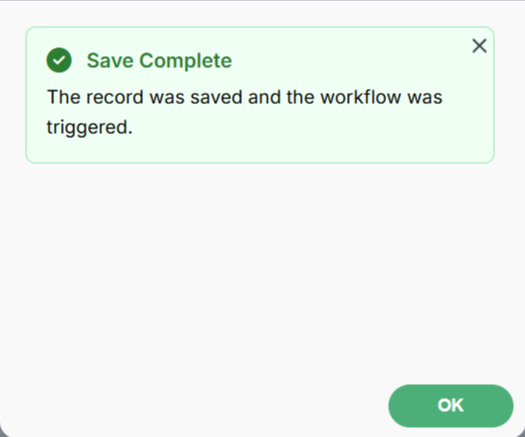 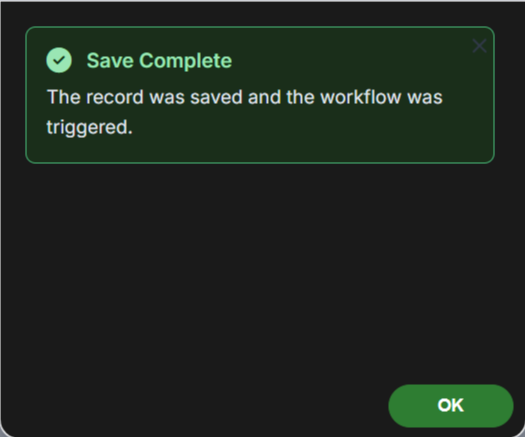

---

### Example 3: Error with Markdown detail

```javascript
mosaic.message.error(
    '**Upload failed.** The selected file type is not supported.\n\n' +
    'Accepted formats: `.pdf`, `.docx`, `.xlsx`',
    {
        title: 'Upload Error',
        width: '500px'
    }
);
```

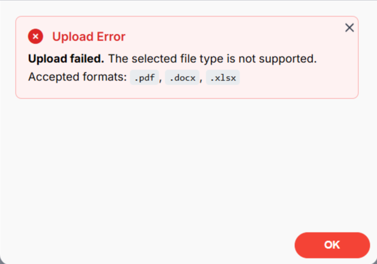 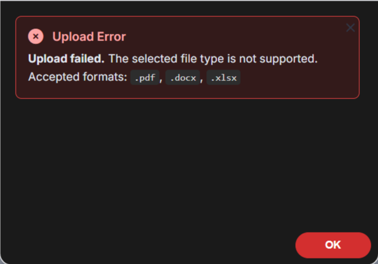

---

### Example 4: Warning with actionable buttons

When you want the user to choose a follow-up action, add custom buttons and check which was clicked.

```javascript
var result = mosaic.message.warning('This account has 3 unpaid invoices totalling $4,200.', {
    title: 'Billing Warning',
    buttons: ['Dismiss', 'View Invoices'],
    width: '480px'
});

if (mosaic.utils.wasButtonClicked(result, 'View Invoices')) {
    // navigate to invoices tab
}
```

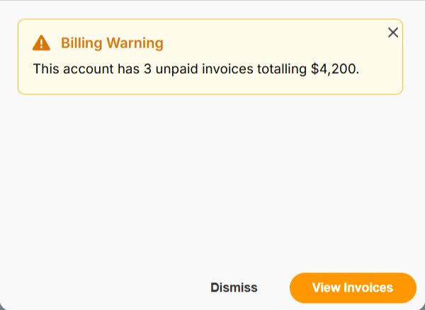 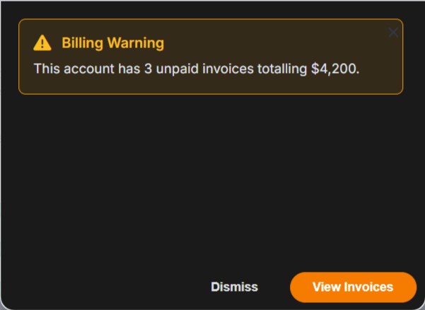

---

### Example 5: Question type

The `question` type renders a question mark icon and works well before branching workflows.

```javascript
var result = mosaic.message.question('This contact has no associated account. Would you like to create one?', {
    title: 'No Account Found',
    buttons: ['Skip', { label: 'Create Account', style: 'primary' }]
});

if (mosaic.utils.wasButtonClicked(result, 'Create Account')) {
    // open account creation flow
}
```

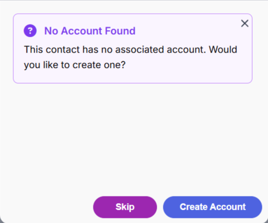 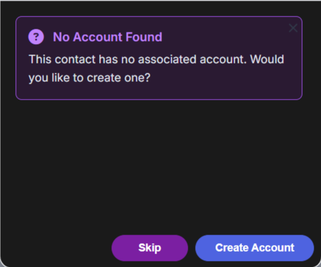

---

### Example 6: Read-only notification with no buttons

Use `show_buttons: false` for purely informational displays, or when you plan to close the popup programmatically.

```javascript
mosaic.message('The sync is running in the background. You will receive an email when it completes.', {
    title: 'Sync Started',
    show_buttons: false
});
```

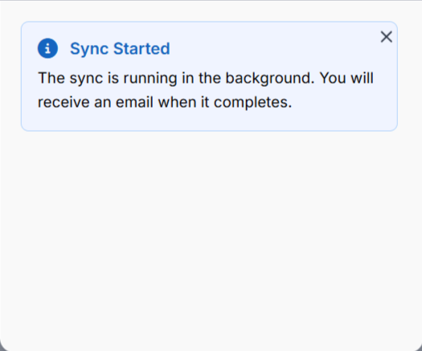 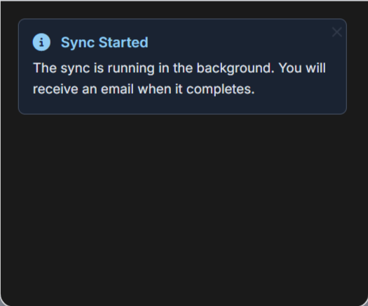

---

### Example 7: Markdown-formatted summary

```javascript
mosaic.message.success(`> **Created**: 55\n> **Updated**: 27\n> **Skipped**: 3`, {
    title: 'Import Complete',
    close_icon: false
});
```

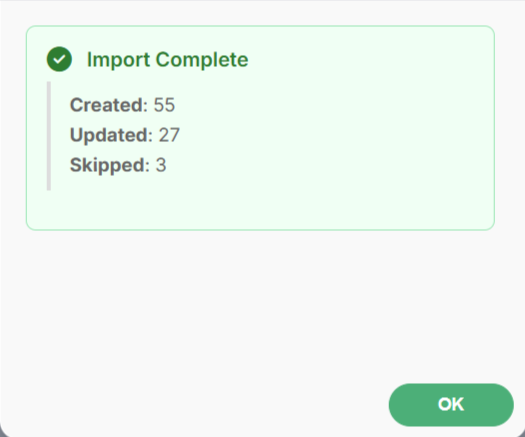 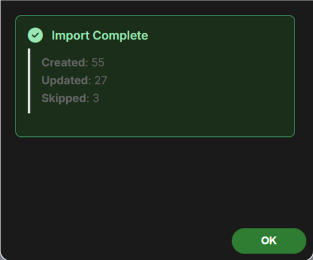
