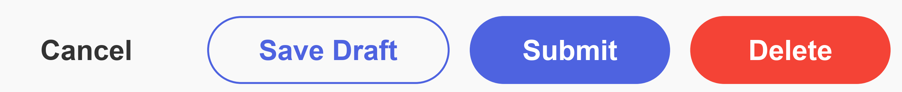
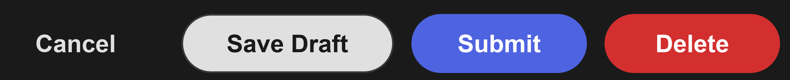
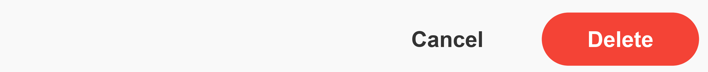
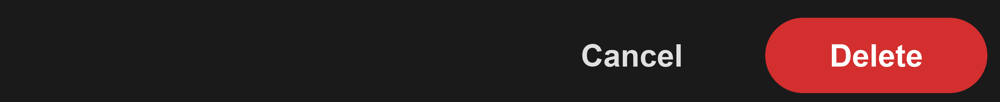
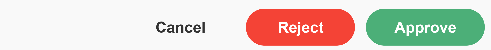

# Buttons

All popup and flyout methods that show footer buttons accept a `buttons` array. Buttons can be plain strings or `{ label, style, value, validate }` objects.

```javascript
buttons: [
    'Cancel',
    { label: 'Save Draft',  style: 'secondary' },
    { label: 'Submit',      style: 'primary' },
    { label: 'Delete',      style: 'destructive' }
]
```




---

## Button Objects

| Property | Type | Default | Description |
|---|---|---|---|
| `label` | string | | Text shown on the button (required) |
| `style` | string | | Visual style - see [Styles](#styles). Setting `style: 'cancel'` also bypasses form validation, same as auto-cancel labels |
| `value` | string | `label` | Return identifier in `response.button_clicked.value`. For `html` / `pdf` viewers, `'download'` and `'print'` also trigger those actions |
| `validate` | boolean | `true` | Set to `false` to skip validation and return the current (unvalidated) form data. Useful for back navigation in multi-page forms or save-draft buttons - see [Multi-page Forms](#multi-page-forms) |

Plain string buttons use the same text for both `label` and `value`.

```javascript
buttons: [
    'Cancel',
    { label: 'Later', value: 'remind_later' },
    { label: 'Skip',  value: 'user_skipped', style: 'cancel' }
]
```

Use `mosaic.utils.wasButtonClicked(result, label)` when you care about the displayed text, and `mosaic.utils.wasButtonValue(result, value)` when you care about the returned identifier.

---

## Styles

| Style | Appearance | Notes |
|---|---|---|
| `primary` | Solid blue | Default for non-cancel buttons |
| `secondary` | Blue outline, transparent background | |
| `cancel` | Muted, no border | Auto-applied by label matching - see below. Also bypasses form validation |
| `destructive` | Red | For delete or irreversible actions |
| `success` | Green | |
| `warning` | Orange | |
| `error` | Red | Same appearance as `destructive` |

---

## Auto-cancel Labels

Buttons with any of the following labels are automatically styled as `cancel` and bypass form validation - no need to set `style: 'cancel'` explicitly:

`cancel` · `close` · `no` · `later` · `dismiss` · `nevermind` · `not now`

Label matching is case-insensitive.

```javascript
// these are equivalent
buttons: ['Cancel', 'OK']
buttons: [{ label: 'Cancel', style: 'cancel' }, 'OK']
```

---

## Auto-destructive Labels

Buttons with any of the following labels are automatically styled as `destructive`:

`delete` · `remove` · `discard` · `yes, delete`

Label matching is case-insensitive. For non-standard labels (e.g. `'Delete Record'`), set `style: 'destructive'` explicitly.

```javascript
// these are equivalent
buttons: ['Cancel', 'Delete']
buttons: ['Cancel', { label: 'Delete', style: 'destructive' }]

// non-standard label needs explicit style
buttons: ['Cancel', { label: 'Delete Record', style: 'destructive' }]
```

---

## Multi-page Forms

For multi-page form flows where `mosaic.form()` is called sequentially, use `validate: false` on the Back button to retrieve whatever the user had filled in when they navigated away — the form closes without enforcing required fields, and the response carries whatever was in the inputs. Store the result and pass it back as `default_values` when re-showing that page.

```javascript
const state = {};

// page 2 - with back navigation
while (true) {
    const r2 = await mosaic.form({
        fields: page2Fields,
        default_values: state.page2 ?? {},
        buttons: [
            { label: 'Back', value: 'back', validate: false },
            { label: 'Next', style: 'primary' }
        ]
    });

    if (r2.button_clicked.value === 'back') {
        state.page2 = r2.data;  // returned without validation
        // re-show page 1...
        continue;
    }
    state.page2 = r2.data;
    break;
}
```

The same pattern works for save-draft buttons, autosave timers, or anywhere you need partial form data without enforcing validation.

See [mosaic.form()](../methods/form.md) for `default_values` usage.

---

## Examples

### Destructive confirmation

```javascript
buttons: ['Cancel', { label: 'Delete', style: 'destructive' }]
```




### Three-way branch

```javascript
buttons: [
    'Cancel',
    { label: 'Save Draft',  style: 'secondary' },
    { label: 'Publish Now', style: 'primary' }
]
```


### Multi-outcome form review

```javascript
buttons: [
    'Cancel',
    { label: 'Reject',  style: 'error' },
    { label: 'Approve', style: 'success' }
]
```




---

> [!NOTE]
> Footer buttons are separate from the inline `button` field type available in `mosaic.form()`. See [Field: button](../reference/fields.md#field-button).
